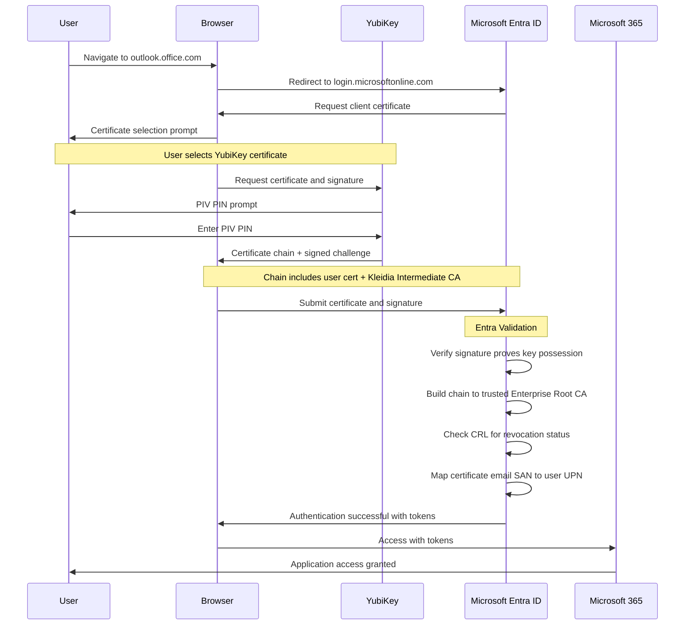
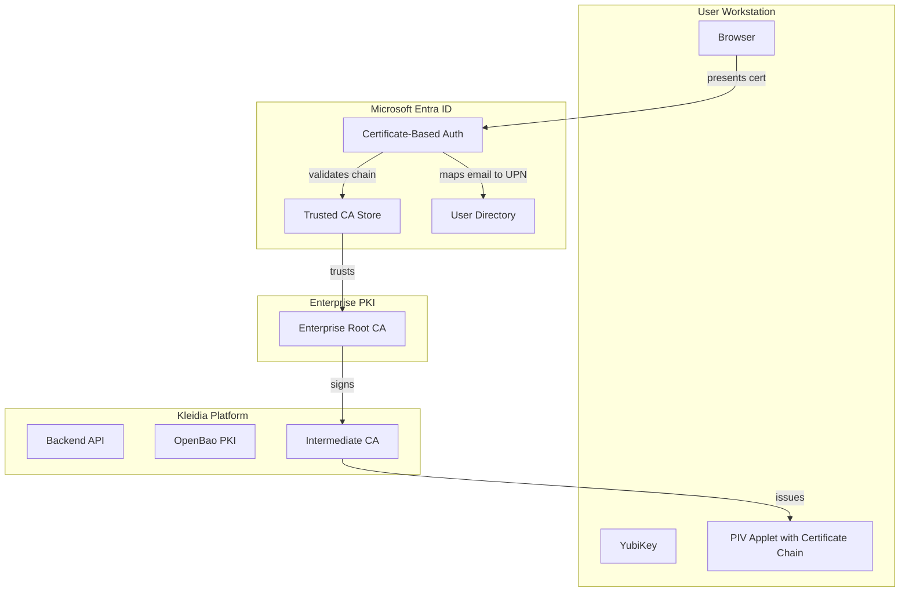
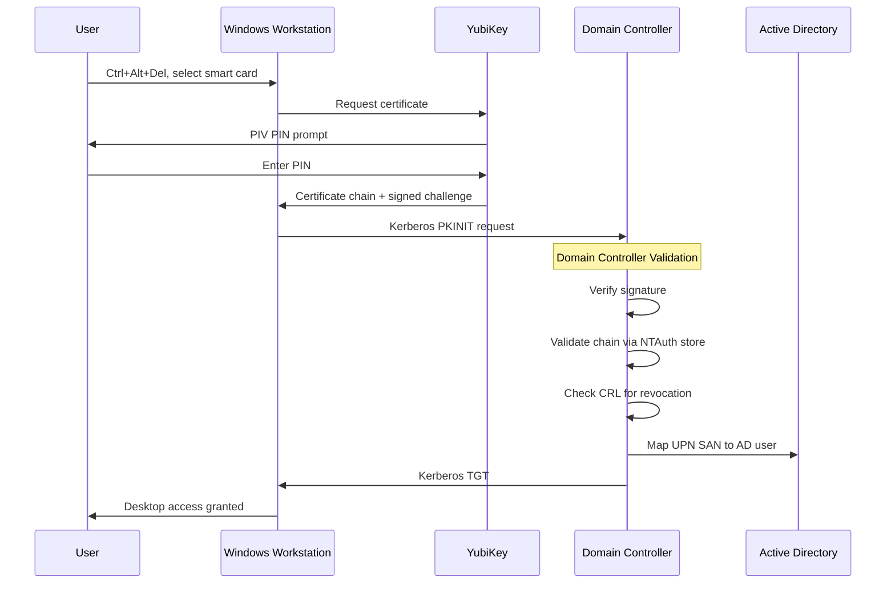

# Microsoft Authentication Integration with Kleidia

This guide covers integrating Kleidia-managed YubiKeys with Microsoft authentication systems for passwordless login:

- **Azure Entra ID** (cloud) - Certificate-Based Authentication (CBA) and FIDO2
- **On-Premises Active Directory** - Smart card authentication via Kerberos PKINIT

## Overview

Kleidia enables organizations to manage YubiKey credentials for authentication with Azure Entra ID. Two authentication methods are supported:

| Method | Technology | Best For |
|--------|------------|----------|
| **PIV Certificate-Based Authentication (CBA)** | X.509 certificates | Automated deployment, enterprise PKI integration |
| **FIDO2 Passkeys** | WebAuthn | Modern cloud-first deployments |

Users can leverage their YubiKeys for:

- **Passwordless sign-in** to Microsoft 365, Azure Portal, and Entra ID-connected applications
- **Multi-factor authentication (MFA)** as a phishing-resistant second factor
- **Conditional Access policies** requiring hardware security keys

## PIV Certificate-Based Authentication (Recommended)

PIV Certificate-Based Authentication enables **fully automated** passwordless login to Entra ID using the PIV certificates issued by Kleidia. Once configured, no per-user registration is required.

### How It Works



### Supported Services

PIV CBA works with any service that uses Entra ID authentication:

| Service | Access Point |
|---------|--------------|
| Microsoft 365 | outlook.office.com, teams.microsoft.com |
| Azure Portal | portal.azure.com |
| Windows Sign-in | Domain-joined or Entra-joined devices |
| Enterprise Apps | Any app using Entra ID SSO |
| Azure VPN | Conditional Access protected VPN |

### Prerequisites

#### Kleidia Requirements (Automatically Configured)

| Component | Status | Description |
|-----------|--------|-------------|
| Intermediate CA | Configured | Kleidia operates as intermediate CA under enterprise Root |
| Email SAN | Included | User email automatically added to certificates |
| Full Certificate Chain | Included | User cert + intermediate CA stored on YubiKey |
| External CRL URL | Configured | CRL accessible from internet for revocation checks |

#### Entra ID Requirements (Customer Configuration)

| Requirement | Location | Notes |
|-------------|----------|-------|
| CBA Enabled | Entra Admin > Protection > Authentication methods | Enable certificate-based authentication |
| Trusted CA | Entra Admin > Protection > CBA > Trusted CAs | Upload enterprise Root CA certificate |
| User Binding | CBA Configuration | Map PrincipalName or RFC822Name to user UPN |

### Configuration Steps

#### Step 1: Enable CBA in Entra ID

1. Navigate to **Entra Admin Center** > **Protection** > **Authentication methods**
2. Select **Certificate-based authentication**
3. Enable for target users/groups
4. Configure authentication binding:
   - **Username binding**: `PrincipalName` or `RFC822Name` (email)
   - **Mapping**: Certificate attribute to Entra user attribute

#### Step 2: Upload Trusted CA

1. Navigate to **Entra Admin Center** > **Protection** > **Certificate-based authentication**
2. Click **Configure** > **Certificate authorities**
3. Upload your enterprise Root CA certificate
4. Configure CRL URL (Kleidia's external PKI URL)

> **Note:** If Kleidia operates as an intermediate CA under your enterprise Root CA, and the Root CA is already trusted in Entra ID, no additional CA upload is needed. The certificate chain on the YubiKey includes the intermediate CA, allowing Entra to validate up to the trusted root.

#### Step 3: Verify User Certificates

After provisioning a YubiKey through Kleidia:

```bash
# View certificate on YubiKey
ykman piv info

# Export and inspect certificate
ykman piv certificates export 9a /tmp/cert.pem
openssl x509 -in /tmp/cert.pem -noout -text | grep -A2 "Subject Alternative Name"
```

Expected output should show the user's email:
```
X509v3 Subject Alternative Name:
    email:user@organization.com, DNS:yubikey-12345678
```

### User Experience

1. User navigates to Microsoft 365 or Azure Portal
2. Browser prompts for certificate selection
3. User selects their YubiKey certificate
4. YubiKey prompts for PIV PIN
5. User enters PIN (4-8 digits)
6. Authentication completes - no password required

### Validation Checklist

| Check | What Entra Validates |
|-------|----------------------|
| Signature | Private key possession (key never leaves YubiKey) |
| Chain | Certificate chains to trusted CA |
| Revocation | Certificate not on CRL |
| User Binding | Email SAN matches Entra user UPN |
| Expiration | Certificate is within validity period |

### Troubleshooting PIV CBA

#### "Certificate not valid for this operation"

1. Verify email SAN matches user's Entra UPN exactly
2. Check that intermediate CA chain is included on YubiKey:
   ```bash
   ykman piv certificates export 9a - | openssl crl2pkcs7 -nocrl -certfile /dev/stdin | openssl pkcs7 -print_certs -noout
   ```
3. Ensure CRL is accessible from internet

#### "The certificate is not from a trusted CA"

1. Verify enterprise Root CA is uploaded to Entra CBA trusted CAs
2. Check certificate chain is complete on YubiKey
3. Confirm intermediate CA is signed by the trusted root

#### "User not found"

1. Verify certificate email SAN matches user's UPN in Entra
2. Check username binding configuration in CBA settings

## Architecture

### PIV Certificate-Based Authentication (CBA)



**Key Points:**
- Kleidia Intermediate CA is signed by Enterprise Root CA
- Enterprise Root CA is trusted in Entra ID
- Full certificate chain stored on YubiKey enables automatic chain validation
- No per-user registration required

### FIDO2 Authentication (Alternative)

```
┌─────────────────────────────────────────────────────────────────────────┐
│                          User Workstation                                │
│  ┌──────────────┐     ┌──────────────┐     ┌──────────────────────────┐ │
│  │   Browser    │────▶│ Kleidia      │────▶│ Local Agent              │ │
│  │              │     │ Frontend     │     │ (ykman fido commands)    │ │
│  └──────────────┘     └──────────────┘     └───────────┬──────────────┘ │
│                                                        │                │
│                                                        ▼                │
│                                              ┌─────────────────┐        │
│                                              │    YubiKey      │        │
│                                              │ ┌─────────────┐ │        │
│                                              │ │ PIV Applet  │ │        │
│                                              │ ├─────────────┤ │        │
│                                              │ │ FIDO2 Applet│◀────┐    │
│                                              │ └─────────────┘ │   │    │
│                                              └─────────────────┘   │    │
└────────────────────────────────────────────────────────────────────┼────┘
                                                                     │
                                                    WebAuthn Challenge
                                                                     │
┌────────────────────────────────────────────────────────────────────┼────┐
│                        Azure Entra ID                              │    │
│  ┌───────────────────────────────────────────────────────────────┐ │    │
│  │                   Authentication Service                       │ │    │
│  │  ┌─────────────────┐   ┌─────────────────┐   ┌──────────────┐ │◀┘    │
│  │  │ FIDO2 Registry  │   │ Conditional     │   │ User Sign-In │ │     │
│  │  │ (Passkeys)      │   │ Access Policies │   │ Methods      │ │     │
│  │  └─────────────────┘   └─────────────────┘   └──────────────┘ │     │
│  └───────────────────────────────────────────────────────────────┘     │
└─────────────────────────────────────────────────────────────────────────┘
```

**Key Points:**
- Requires per-user registration at Microsoft Security Info
- FIDO2 credentials bound to specific domain (login.microsoftonline.com)
- Separate FIDO2 PIN from PIV PIN

## On-Premises Active Directory Smart Card Authentication

For organizations using on-premises Active Directory (without Entra ID), Kleidia-issued PIV certificates can be used for Windows smart card login.

### How It Works



### Key Differences from Entra ID

| Aspect | Entra ID CBA | On-Prem AD Smart Card |
|--------|--------------|----------------------|
| Protocol | TLS Client Auth | Kerberos PKINIT |
| User Binding | Email SAN → UPN | UPN SAN → AD userPrincipalName |
| Trust Store | Entra Admin Portal | NTAuth + Enterprise Trust |
| CRL Access | Internet accessible | Can be internal |
| EKU Required | ClientAuth | ClientAuth + Smart Card Logon |

### Certificate Requirements

Kleidia authentication certificates include both EKUs:

| Extended Key Usage | OID | Purpose |
|-------------------|-----|---------|
| Client Authentication | 1.3.6.1.5.5.7.3.2 | Entra ID CBA, TLS client auth |
| Smart Card Logon | 1.3.6.1.4.1.311.20.2.2 | Windows smart card login |

### On-Prem AD Configuration

#### Step 1: Publish CA to NTAuth Store

The NTAuth store controls which CAs can issue smart card logon certificates.

```powershell
# On a Domain Controller or machine with AD tools

# Export Kleidia Intermediate CA certificate
# (Obtain from Kleidia admin or OpenBao)

# Publish to NTAuth store (allows smart card logon)
certutil -dspublish -f KleidiaIntermediateCA.cer NTAuthCA

# Publish to Enterprise Trust (establishes chain trust)
certutil -dspublish -f KleidiaIntermediateCA.cer SubCA

# If using separate Root CA, also publish it
certutil -dspublish -f EnterpriseRootCA.cer RootCA

# Force Group Policy update
gpupdate /force
```

#### Step 2: Configure CRL Distribution

Ensure the CRL is accessible from domain-joined workstations:

```powershell
# Verify CRL accessibility
certutil -verify -urlfetch <certificate.cer>
```

For internal CRL distribution, configure:
- HTTP: `http://pki.internal.domain/crl/kleidia.crl`
- LDAP: `ldap:///CN=Kleidia,CN=CDP,CN=Public Key Services,CN=Services,CN=Configuration,DC=domain,DC=com`

#### Step 3: Group Policy Configuration

Enable smart card authentication via Group Policy:

1. **Computer Configuration** > **Policies** > **Windows Settings** > **Security Settings** > **Local Policies** > **Security Options**
2. Configure:
   - "Interactive logon: Smart card removal behavior" = Lock Workstation
   - "Interactive logon: Require smart card" = Enabled (optional, for high-security)

### Troubleshooting On-Prem AD

#### "The smart card certificate used for authentication was not trusted"

1. Verify CA is in NTAuth store:
   ```powershell
   certutil -viewstore -enterprise NTAuth
   ```
2. Check certificate chain is complete on YubiKey
3. Verify CRL is accessible from workstation

#### "The system could not log you on" after PIN entry

1. Check certificate has Smart Card Logon EKU:
   ```bash
   ykman piv certificates export 9a - | openssl x509 -noout -text | grep -A5 "Extended Key Usage"
   ```
2. Verify UPN SAN matches AD userPrincipalName
3. Check Domain Controller event logs for PKINIT errors

#### Certificate not appearing in smart card selection

1. Verify certificate is in slot 9a (Authentication)
2. Check Windows smart card service is running:
   ```powershell
   Get-Service SCardSvr
   ```
3. Try reinserting YubiKey

## General Prerequisites

### Kleidia Requirements
- Kleidia deployed and accessible to users
- Local agent installed on user workstations
- YubiKey 5 series (or newer)

### Azure Entra ID Requirements
- Azure Entra ID Premium P1 or P2 license
- Certificate-based authentication or FIDO2 method enabled
- User has appropriate licensing

---

## FIDO2 Authentication (Alternative Method)

For organizations that prefer FIDO2/WebAuthn over PIV certificates, or for applications that don't support CBA, FIDO2 passkeys provide an alternative authentication method.

> **Note:** FIDO2 requires per-user registration at Microsoft Security Info. For automated, zero-touch deployment, use PIV Certificate-Based Authentication instead.

## FIDO2 Registration Process

### Step 1: Set FIDO2 PIN in Kleidia

Before registering the YubiKey with Azure Entra ID, users must set a FIDO2 PIN:

1. Navigate to **Dashboard > YubiKeys** in Kleidia
2. Select the YubiKey to configure
3. Open the **FIDO2** management card
4. In the **PIN** tab, set a FIDO2 PIN (4-63 characters)

> **Note:** FIDO2 PIN is separate from PIV PIN. Users should track both.

### Step 2: Register Security Key with Azure Entra ID

1. Navigate to [Microsoft Security Info](https://aka.ms/mysecurityinfo)
2. Click **Add sign-in method**
3. Select **Security key**
4. Choose **USB device**
5. Follow the prompts:
   - Insert YubiKey when prompted
   - Enter FIDO2 PIN
   - Touch the YubiKey when LED flashes
6. Name the security key (e.g., "Work YubiKey - Kleidia Managed")

### Step 3: Verify Registration in Kleidia

After registration, the service domain should appear in Kleidia:

1. Navigate to the YubiKey in Kleidia
2. Open the **FIDO2** card
3. Go to the **Credentials** tab
4. Enter FIDO2 PIN to view registered services
5. Verify `login.microsoftonline.com` appears in the list

## Dual Deployment: PIV + FIDO2

Organizations can leverage both PIV and FIDO2 capabilities on the same YubiKey:

### Use Cases

| Authentication Scenario | Recommended Method | Notes |
|-------------------------|-------------------|-------|
| Windows Smart Card Login | PIV Certificate | Native Windows smart card support |
| VPN/Network Access | PIV Certificate | Works with certificate-based VPN |
| Microsoft 365 | PIV Certificate (CBA) | Fully automated, no per-user registration |
| Azure Portal | PIV Certificate (CBA) | Seamless with enterprise PKI |
| Web Applications (SSO) | PIV CBA or FIDO2 | CBA for enterprise, FIDO2 for modern apps |
| Code Signing | PIV Certificate (9c) | Kleidia manages code signing certs |
| Email Signing (S/MIME) | PIV Certificate (9d) | Kleidia manages email signing certs |

> **Recommendation:** Use PIV Certificate-Based Authentication for Entra ID when your organization has an established enterprise PKI. PIV CBA requires no per-user registration and integrates seamlessly with Kleidia's automated certificate provisioning.

### Best Practices for Dual Deployment

1. **PIN Management**
   - PIV PIN and FIDO2 PIN are independent
   - Consider using the same PIN for user convenience (but understand the security trade-off)
   - Document both PINs in user's password manager

2. **Certificate vs. Passkey**
   - Use PIV certificates for legacy systems and smart card requirements
   - Use FIDO2 for modern cloud services and phishing-resistant authentication

3. **Recovery Planning**
   - PIV: PUK can unblock locked PIN
   - FIDO2: No PUK equivalent; locked FIDO2 requires applet reset
   - Maintain backup authentication methods in Azure Entra ID

## Conditional Access Configuration

### Example Policy: Require FIDO2 for Sensitive Resources

```json
{
  "displayName": "Require FIDO2 Security Key for Azure Portal",
  "state": "enabled",
  "conditions": {
    "applications": {
      "includeApplications": [
        "Azure Portal"
      ]
    },
    "users": {
      "includeUsers": ["All"]
    }
  },
  "grantControls": {
    "operator": "AND",
    "builtInControls": [
      "mfa"
    ],
    "authenticationStrength": {
      "id": "00000000-0000-0000-0000-000000000004"
    }
  }
}
```

> **Note:** Authentication strength ID `00000000-0000-0000-0000-000000000004` corresponds to "Phishing-resistant MFA" which requires FIDO2 or certificate-based authentication.

### Creating a Custom Authentication Strength

To specifically require YubiKey FIDO2 authentication:

1. Navigate to **Entra Admin Center > Protection > Authentication methods > Authentication strengths**
2. Create a new custom strength
3. Select only **FIDO2 security key**
4. Optionally add **Certificate-based authentication** for PIV fallback
5. Use this custom strength in Conditional Access policies

## Troubleshooting

### Common Issues

#### "No security key registered" during sign-in

1. Ensure FIDO2 PIN is set in Kleidia
2. Verify key is registered at [aka.ms/mysecurityinfo](https://aka.ms/mysecurityinfo)
3. Check if FIDO2 method is enabled for the user in Entra ID

#### "Wrong PIN" error during registration

1. Verify you're using FIDO2 PIN (not PIV PIN)
2. Check FIDO2 PIN retries in Kleidia FIDO2 card
3. If locked, reset FIDO2 applet in Kleidia (erases all passkeys)

#### Registration fails with "Security key not supported"

1. Ensure YubiKey firmware supports CTAP 2.0+
2. Check browser compatibility (Chrome, Edge, Firefox supported)
3. Verify WebAuthn/FIDO2 is enabled in Azure Entra ID

#### User can't sign in after YubiKey deletion in Kleidia

When a YubiKey is deleted in Kleidia with factory reset:
1. All FIDO2 credentials are erased from the key
2. Azure Entra ID still shows the key as registered
3. User must manually remove the old key from [Security Info](https://aka.ms/mysecurityinfo)
4. Re-register the reset YubiKey as a new security key

### Diagnostic Commands

Check FIDO2 status on YubiKey (via ykman):
```bash
# List FIDO2 info
ykman fido info

# List registered credentials (requires PIN)
ykman fido credentials list
```

## Security Considerations

### Phishing Resistance

FIDO2/WebAuthn provides strong phishing resistance because:
- Credentials are bound to specific domain origins
- Private keys never leave the YubiKey
- Registration and authentication require physical presence (touch)

### PIN Protection

- FIDO2 PIN protects against stolen device scenarios
- 8 retry attempts before lockout
- Lockout requires FIDO2 applet reset (erases all credentials)

### Credential Management

- Kleidia provides visibility into registered RP domains
- Full usernames are not displayed for privacy
- Factory reset erases all FIDO2 credentials when YubiKey is deleted

## Related Documentation

- [Kleidia FIDO2 Management Guide](../05-using-the-system/fido2-management.md)
- [YubiKey Lifecycle Management](../05-using-the-system/yubikey-lifecycle.md)
- [Microsoft: Configure FIDO2 security keys](https://learn.microsoft.com/en-us/azure/active-directory/authentication/howto-authentication-passwordless-security-key)

