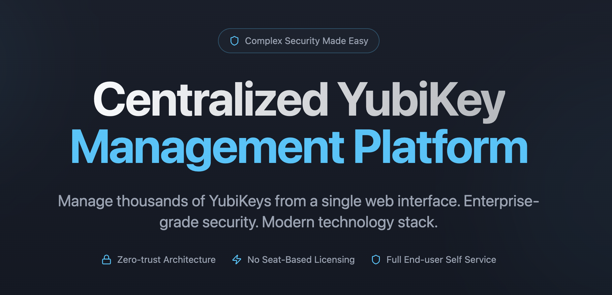

  

  <a href="https://kleidia.io">🌐 kleidia.io</a> • <a href="https://docs.kleidia.io">📖 docs.kleidia.io</a>

---

# Kleidia Customer Documentation

> **📖 Live Documentation Site**: [docs.kleidia.io](https://docs.kleidia.io)
>
> This repository contains the source markdown files for the Kleidia documentation. For the best reading experience with navigation, search, and dark mode, visit the documentation site.

## About This Documentation

This documentation is designed for **Kleidia customers** who need to:

- **Deploy and operate** Kleidia in production environments
- **Understand the architecture** and security model
- **Configure and maintain** the system
- **Use the system** for YubiKey management

## Documentation Structure

### [00 - Overview](00-overview/)
- [Product Overview](00-overview/index.md) — What is Kleidia and what it does
- [Core Principles](00-overview/principles.md) — Architectural principles and design decisions
- [POC Quickstart](00-overview/poc-quickstart.md) — First YubiKey journey for evaluation
- [Start Here Guides](00-overview/start-here/) — Role-based entry points

### [01 - Architecture](01-architecture/)
- [System Overview](01-architecture/system-overview.md) — High-level architecture
- [Components](01-architecture/components.md) — Component descriptions and responsibilities
- [Data Flows](01-architecture/data-flows.md) — Communication patterns
- [Agent Communication](01-architecture/agent-communication.md) — How the agent works

### [02 - Security](02-security/)
- [Security Overview](02-security/security-overview.md) — Security model and threat mitigation
- [Vault and Secrets](02-security/vault-and-secrets.md) — Secrets management
- [Certificates and PKI](02-security/certificates-and-pki.md) — PKI management
- [Authentication Model](02-security/auth-model.md) — Authentication and authorization
- [Compliance](02-security/compliance-considerations.md) — Compliance considerations
- [Security for Auditors](02-security/for-auditors.md) — One-pager for security audits

### [03 - Deployment](03-deployment/)
- [Prerequisites](03-deployment/prerequisites.md) — System requirements
- [Helm Installation](03-deployment/helm-install.md) — Helm chart deployment
- [Configuration](03-deployment/configuration.md) — Configuration management
- [Vault Setup](03-deployment/vault-setup.md) — OpenBao setup
- [PKI Integration](03-deployment/pki-integration.md) — PKI integration patterns
- [Azure Entra Integration](03-deployment/azure-entra-integration.md) — OIDC setup
- [Upgrades](03-deployment/upgrades-and-rollback.md) — Upgrade procedures
- [Troubleshooting](03-deployment/troubleshooting.md) — Common issues

### [04 - Operations](04-operations/)
- [Daily Operations](04-operations/daily-operations.md) — Day-to-day tasks
- [Monitoring](04-operations/monitoring-and-logs.md) — Health checks and logs
- [Backups](04-operations/backups-and-restore.md) — Backup and restore
- [Runbooks](04-operations/runbooks.md) — Incident response procedures

### [05 - Using the System](05-using-the-system/)
- [Agent Installation](05-using-the-system/agent-installation.md) — Install agent on workstations
- [End User Guide](05-using-the-system/end-user-guide.md) — User-facing features
- [Admin Guide](05-using-the-system/admin-guide.md) — Administrative features
- [YubiKey Lifecycle](05-using-the-system/yubikey-lifecycle.md) — Device lifecycle management
- [FIDO2 Management](05-using-the-system/fido2-management.md) — WebAuthn/FIDO2 features

### [06 - Reference](06-reference/)
- [Agent Quick Reference](06-reference/agent-quick-reference.md) — Commands and scripts
- [Glossary](06-reference/glossary.md) — Terms and definitions
- [Ports and Services](06-reference/ports-and-services.md) — Network requirements
- [Permissions](06-reference/permissions-and-policies.md) — RBAC and policies
- [Compatibility Matrix](06-reference/compatibility-matrix.md) — Supported platforms

### [07 - Installers](07-Installers/)
- [macOS Enterprise Deployment](07-Installers/MacOS/ENTERPRISE_DEPLOYMENT.md) — Intune, Jamf, Munki
- [Windows Enterprise Deployment](07-Installers/Windows/ENTERPRISE_DEPLOYMENT.md) — GPO, Intune, SCCM
- Installer packages available in each platform folder

## Quick Start

1. **New to Kleidia?** Start with [Overview](00-overview/index.md)
2. **Evaluating?** Follow the [POC Quickstart](00-overview/poc-quickstart.md)
3. **Planning deployment?** Read [Prerequisites](03-deployment/prerequisites.md)
4. **Need to configure?** See [Configuration](03-deployment/configuration.md)
5. **Installing agent?** Follow [Agent Installation](05-using-the-system/agent-installation.md)
6. **Download installers?** Visit [GitHub Releases](https://github.com/kleidia-org/kleidia/releases)

## Role-Based Entry Points

| Role | Start Here |
|------|------------|
| **Security Leads** | [Start Here for Security Leads](00-overview/start-here/for-security-leads.md) |
| **Operations** | [Start Here for Operations](00-overview/start-here/for-operations.md) |
| **Helpdesk** | [Start Here for Helpdesk](00-overview/start-here/for-helpdesk.md) |

## Audience

This documentation is written for:

- **Security Leads**: Evaluating security controls, compliance, and audit requirements
- **Operations Administrators**: Deploying, configuring, and maintaining Kleidia
- **Helpdesk Staff**: Supporting end users with YubiKey issues
- **End Users**: Using Kleidia to manage YubiKey devices

## What's Not Included

This documentation does **not** include:

- Developer debugging guides
- Internal API development details
- Code-level implementation details
- Testing procedures for developers
- Experimental or deprecated features

## Support

For technical support or questions about this documentation:

- Check the troubleshooting sections in [Operations](04-operations/)
- Review the [Reference](06-reference/) section for technical details
- Contact your Kleidia support representative

## Documentation Version

This documentation corresponds to **Kleidia version 2.2.0**.

## License

See [LICENSE](LICENSE) for licensing information.
